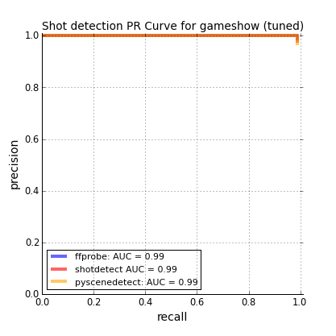
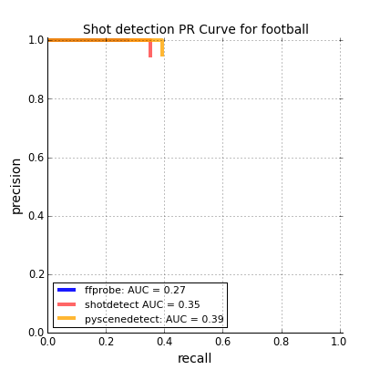
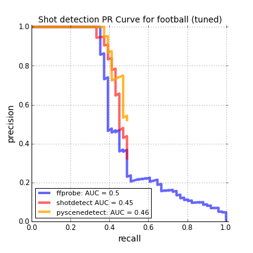
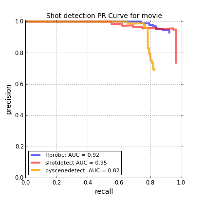
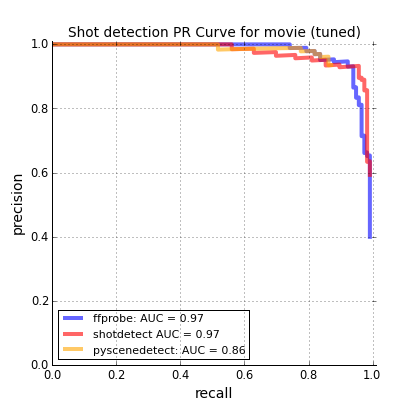

#Shot Detection Benchmarks

This is a comparison of the [shot transition detection](https://en.wikipedia.org/wiki/Shot_transition_detection) performance of [FFmpeg](https://github.com/FFmpeg/FFmpeg) (in particular, the *ffprobe* tool), [Shotdetect](https://github.com/johmathe/Shotdetect) and [PySceneDetect](https://github.com/Breakthrough/PySceneDetect) (in *content* mode).  

##Data

The test data consists of three youtube videos which were chosen to represent the various kinds of footage that might require shot detection:

* [Tv gameshow clip](https://www.youtube.com/watch?v=fkiDpLlQ9Wg) (the first 05:00 is used) 
* [Sports clip](https://www.youtube.com/watch?v=vFT8HXJlvfA) (05:11)
* [Movie clip](https://www.youtube.com/watch?v=bpLtXIlkyYA) (03:12)

The gameshow clip is filmed in a reasonably well-lit environment with crisp shot transitions. The sports clip contains slower shot transitions and a great deal of movement from the players, but fairly constrained camera movements. The movie clip is an action scene with vibrant colors and rapid camera movement. Each video was annotated manually for shot transitions.

##Results 

For each dataset, the tools are first evaluated with their suggested defaults, then with parameters found through hand tuning. This tuning is done with the intention of maximizing the area under the *precision-recall* curve, typically by reducing the detection thresholds (see notebooks for chosen parameters). 

*NOTE: Depending on your application, you might prefer to keep a high precision at the expense of lower recall, in which case the default settings for each tool are reasonable.* 

###TV Gameshow

  

On the TV gameshow clip (a UK Deal Or No Deal episode), all shot detectors achieve almost perfect precision and recall with their default settings (the `ffprobe` and `PySceneDetect` curves lie beneath the `Shotdetect` curve).  The only error they make is caused by some jank in the original footage (visible around 1:02 seconds on the youtube video). The default thresholds were left unchanged. 

###Sports

  

The sports footage (an international football match) proved considerably more challenging for the shot detectors. With the default settings, the recall for every tool is fairly poor with `PySceneDetect` slightly outperforming the other tools.  With tuning, recall could be increased at the expense of precision.  

*NOTE: This video was more challenging than the first for a couple of reasons. First, the detectors struggled with the fades between shots which are difficult to detect when statistics are computed between consecutive frames.  Second, much of the background was green (the football pitch) so that even when shots changed, the background was still dominated by a single color.*

###Movie

  

The movie footage (a beach-based battle scene from Troy) was considerably easier than the sports but still more challenging than the TV gameshow. All detectors performed reasonably well, although `PySceneDetect` struggled with recall. Overall, `Shotdetect` performed best on this video. 

##Speed

There are significant differences in the speed of each tool. The following timing benchmarks should be considered **approximate** since they include minor time costs external to the tools (parsing the output string for the results).  Despite this, they give a reasonable indicator of the relative speed of each tool.  Note that the videos have the same frame rate (25 fps), but different resolutions (this affects the speed of the tools to different degrees).

| Tool          | Gameshow clip        | Football clip |    Movie clip |
| ------------- | --------------------:| -------------:| -------------:|
| `ffprobe`       | 2.46s                 | 6.9s       | 4.21s         |
| `Shotdetect`    | 21.3s                | 45.5        | 20.6s         |
| `PySceneDetect` | 5min 27s             | 1min 57s    | 56.8s         |

**Details:**

* The time recorded was the best from 3 runs (see notebooks for details) 
* Hardware: mid 2014-Macbook Pro, 3 GHz Intel Core i7
* `ffprobe` is written in C, `Shotdetect` is written (mostly) in C++ and `PySceneDetect` is written in Python. 
* Both ffprobe and shotdetect were wrapped in Python calls (adding a marginal time cost)
* Each run includes the time spent parsing the results from console outputs (should be similar for each tool)
* The benchmark code was written/run using Python 2.7.10.

##Notes

In the cases of both `PySceneDetect` and `ShotDetect`, the code was modified slightly to expose the confidence of each shot boundary prediction and print to screen rather save to file to make the speed benchmarks fairer (see [here](https://github.com/albanie/PySceneDetect/commit/0ba9759a0a3eeba4caa07800fff088730dfd4ace) and [here](https://github.com/albanie/Shotdetect/commit/116999e0e3139a106f93f4fa5df6309103b8aadd) for the mods). 
